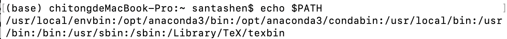
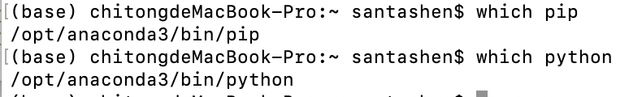
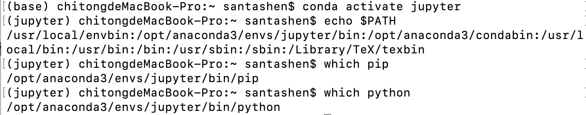

### conda虚拟环境
#### 虚拟环境实现原理
虚拟环境的实现通过改变环境变量实现，在base环境下环境变量如下：
***

***
其中anaconda3/bin的路径放在了最前面（envbin见后），这样在调用如pip，python等命令时，系统会依据环境变量的顺序从前往后寻找，这时找到的就是base环境中对应的pip和python等：
***

***
此时激活新的环境，环境变量也会发生改变：
***

***
虚拟环境的库和可执行文件储存的结构和anaconda3的base目录下是完全一致的，此时anaconda3/envs/jupyter/bin的目录放在的最前面，此时系统找到的就是新环境下的对应内容。
#### 自定义环境变量
由于conda莫名其妙的依赖，自己安装的nodejs永远升级不到14，但是jupyterlab许多插件需要nodejs版本高于14，这时必须手动安装高版本的nodejs，并让它覆盖conda安装的nodejs。这可以通过改变环境变量的顺序实现。在mac里遇到了几个问题：
1. nodejs默认安装到/usr/local/bin的目录下，然而这个目录下有系统自带的python，如果把它在环境变量中置顶，会导致conda的虚拟环境失效。这可以通过挪动nodejs的位置来克服。
2. 一旦激活了虚拟环境，虚拟环境的bin路径自动置顶了，这导致conda安装的nodejs又放到了前面，这可以通过conda给出手动调整虚拟环境下环境变量的方式实现：
https://docs.conda.io/projects/conda/en/latest/user-guide/tasks/manage-environments.html
#### 调整环境变量
进入到anaconda3目录下的etc/conda目录下，创建activate.d和deactivate.d文件夹，创建env_vars.sh两个文件：

```shell
cd $CONDA_PREFIX
mkdir -p ./etc/conda/activate.d
mkdir -p ./etc/conda/deactivate.d
touch ./etc/conda/activate.d/env_vars.sh
touch ./etc/conda/deactivate.d/env_vars.sh
```

此时可以通过改变这两个.sh脚本来控制在conda activate和conda deactivate时额外做的工作，比如按照官网给的例子，编辑./etc/conda/activate.d/env_vars.sh如下：

```shell
#!/bin/sh

export MY_KEY='secret-key-value'
export MY_FILE=/path/to/my/file/
```

编辑./etc/conda/deactivate.d/env_vars.sh：

```shell
#!/bin/sh

unset MY_KEY
unset MY_FILE
```

这时激活虚拟环境时，`MY_KEY`和`MY_FILE`两个变量的值就设置成了`'secret-key-value'`和`/path/to/my/file/`，就变成了环境中的全局变量。在conda deactivate后，这些全局变量再被抹去。要改变环境变量的值，可以做一些微小的改动：

编辑./etc/conda/activate.d/env_vars.sh：

```shell
export OLD_PATH=$PATH
export FIRST_PATH=/usr/local/envbin
export PATH="${FIRST_PATH}:$PATH"
```

编辑./etc/conda/deactivate.d/env_vars.sh：

```shell
export PATH=$OLD_PATH
unset OLD_PATH
unset FIRST_PATH
```

/usr/local/envbin就是储存nodejs可执行文件的地方，这时每次打开conda，这个路径就被置顶了。