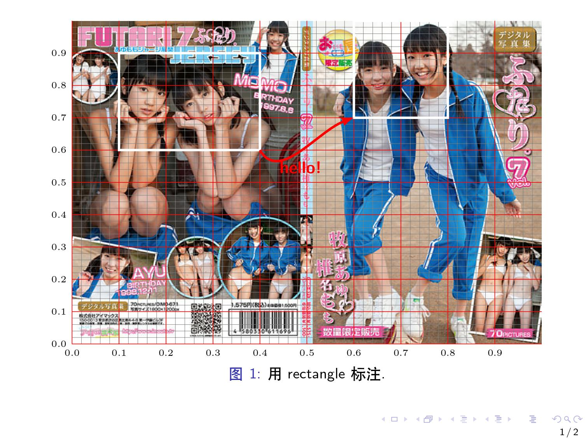

# 用TIKZ做图片注释
在beamer想要对一张图做一些标注，用tikz标注时很难确定位置，参考regi://wenda.latexstudio.net/article-5068.html修改了一下画辅助网格的宏：
## 说明
1. adjustbox可以保证缩放后tikzpicture各元素的相对位置不变
2. `\drawgrid`的第一个参数为网格x轴的最大长度，第二个参数为y轴的最大长度
3. `\pgfmathprintnumber[textnumber]`调整数字显示精度，这里保留坐标轴刻度一位小数
4. Tikz里node的内容可以是一张图，要对这种图做caption需要采用caption宏包，在另一个node里放置caption，如下所示
5. `scope`环境用于作用域控制，生成一个局域环境，参数只影响内部，外部的参数不影响内部，同时可以生成相对坐标，下面就是让图片的右下角为(1,0)，左上角为(0,1)
6. `\draw (A) rectangle (B)`可以画一个矩形，但是这样生成的矩形是没有名字的，可以用Tikz的fit库定义一个node的位置，用它来充当矩形，这时这个矩形就有名字了，也就可以定义他们之间的相对位置了
```latex
\documentclass{beamer}
\setbeamertemplate{footline}[frame number]
\setbeamertemplate{caption}[numbered]
\usepackage{ctex}
\usepackage{adjustbox}
\usepackage{pgfplots}
\usepackage{caption}
\pgfplotsset{compat=1.17}
\pgfplotsset{
	/pgf/number format/textnumber/.style={
		fixed,
		fixed zerofill,
		precision=1,
	},
}
\usepackage{tikz}
\usetikzlibrary{positioning, calc,fit}

\newcommand{\drawgrid}[2]{
	\draw[very thin, draw=gray, step=0.02] (0,0) grid (#1,#2);
	\draw[thin, draw=red, xstep=0.1, ystep=0.1] (0,0) grid (#1,#2);
	\foreach \x in {0,0.1,...,#1} {
		\node [anchor=north] at (\x,0) {\tiny \pgfmathprintnumber[textnumber]{\x}};
	}
	\foreach \y in {0,0.1,...,#2} {
		\node [anchor=east] at (0,\y) {\tiny \pgfmathprintnumber[textnumber]{\y}};
	}
}%
\begin{document}

\begin{frame}
	\begin{adjustbox}{width=\linewidth}
		\begin{tikzpicture}
			\node[anchor=south west,inner sep=0] (image) at (0,0) {\includegraphics[width=\linewidth]{ji ji.jpg}};
			\node[inner sep=0pt,below=\belowcaptionskip of image,text width=\linewidth]
			{\captionof{figure}{用rectangle标注.}\label{fig:fig1}};
			\begin{scope}[x={(image.south east)},y={(image.north west)}]
				% 辅助网格
				\drawgrid{1}{1}
				\draw[white,ultra thick] (0.1,0.6) rectangle (0.4,0.9);
				\draw[white,ultra thick] (0.6,0.7) rectangle (0.8,1.0);
				\draw[red,ultra thick,-latex] (0.4,0.6) to [out=-60,in=200] node[anchor=north,red,yshift=-2] {\textbf{hello!}} (0.6,0.7);
			\end{scope}
		\end{tikzpicture}
	\end{adjustbox}
\end{frame}

\begin{frame}
	\begin{adjustbox}{width=\linewidth}
		\begin{tikzpicture}
			\node[anchor=south west,inner sep=0] (image) at (0,0) {\includegraphics[width=\linewidth]{ji ji.jpg}};
			\node[inner sep=0pt,below=\belowcaptionskip of image,text width=\linewidth]
			{\captionof{figure}{用fit标注.}\label{fig:fig2}};
			\begin{scope}[x={(image.south east)},y={(image.north west)}]
				% 辅助网格
				\drawgrid{1}{1}
				\node[fit={(0.1,0.6) (0.4,0.9)}, inner sep=0pt, draw=white, ultra thick] (box1) {};
				\node[fit={(0.6,0.7) (0.8,1)}, inner sep=0pt, draw=white, ultra thick] (box2) {};
				\draw[red,ultra thick,-latex] (box1.south east) to [out=-60,in=200] node[anchor=north,red,yshift=-2] {\textbf{hello!}} (box2.south west);
			\end{scope}
		\end{tikzpicture}
	\end{adjustbox}
\end{frame}
\end{document}
```

