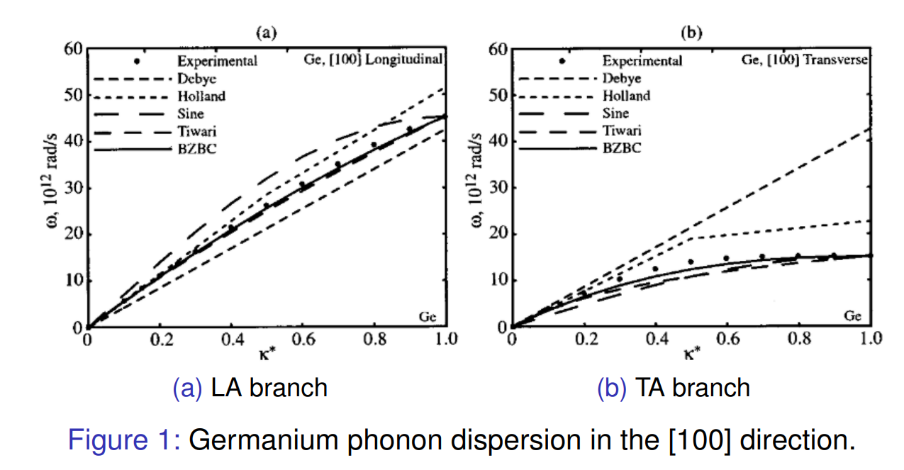
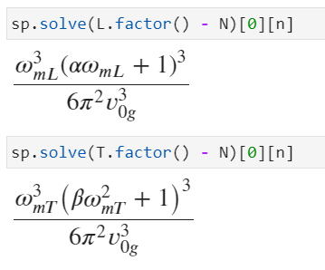
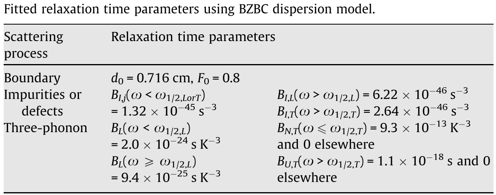

# 声子色散模型

> 在我看来，数学书（包括论文）是最晦涩难懂的读物。将一本几百页的数学书从头到尾读一遍更是难上加难。翻开数学书，定义、公理扑面而来，定理、证明接踵而至。数学这种东西，一旦理解则非常简单明了，所以我读数学书的时候，一般都只看定理，努力去理解定理，然后自己独立思考数学证明。不过，大多数情况下都是百思不得其解，最终只好参考书中的证明。然而，有时候反复阅读证明过程也难解其意，这种情况下，我便会尝试在笔记本中抄写这些数学证明。在抄写过程中，我会发现证明中有些地方不尽如人意，于是转而寻求是否存在更好的证明方法。如果能顺利找到还好，若一时难以觅得，则多会陷入苦思，至无路可走、油尽灯枯才会作罢。按照这种方法，读至一章末尾，已是月余，开篇的内容则早被忘到九霄云外。没办法，只好折返回去从头来过。之后，我又注意到书中整个章节的排列顺序不甚合理。比如，我会考虑将定理七的证明置于定理三的证明之前的话，是否更加合适。于是我又开始撰写调整章节顺序的笔记。完成这项工作后，我才有真正掌握第一章的感觉，终于送了一口气，同时又因太耗费精力而心生烦忧。从时间上来说，想要真正理解一本几百页的数学书，几乎是一件不可能完成的任务。真希望有人告诉我，如何才能快速阅读数学书。
>
> ---- 小平邦彦，<惰者集>
>
> 

波数用第一布里渊区的边界值来无量纲化：
$$
\kappa^{*}=\kappa / \kappa_{m}=\kappa /(2 \pi / a)
$$


## 声子色散模型

### Debye 模型

$$
\omega = v_{0g}\kappa
$$

$v_{0g}$为$\kappa \rightarrow 0$时的声子群速度。Debye模型不区分横光学支和纵光学支，且假设所有频率的声子都满足上述同样的色散关系。由于实际上横声学支和纵声学支的声子群速度并不一样，因此在实际使用Debye色散时需要确定一个平均声子群速度，比如
$$
\frac{1}{v_{0 g}}=\frac{1}{3}\left(\frac{1}{v_{0 g, L}}+\frac{2}{v_{0 g, T}}\right)
$$
其中$v_{0g,L}$和$v_{0g,T}$分别是纵声学支和横声学支的声子群速度，$v_{0g}$就是平均后的声子群速度。比如对于[1 0 0 ]的晶体锗来说，$v_{0g,L} = 5142m/s,v_{0g,T} = 3391m/s$，最后得到$v_{0g} = 3825m/s$

### Holland 模型

Holland模型把纵声学支和两个横声学支分开考虑，同时每一支的色散曲线拆成两个线性的部分，在$\kappa^* \leq 0.5$时使用群速度$v_{0g}$，在$\kappa^* > 0.5$使用群速度$v_{0.5g}$：
$$
\left\{
\begin{array}{l}
\omega = v_{0g,T}\kappa, \quad \kappa^* \leq 0.5 \\
\omega =  v_{0.5g,T}\kappa, \quad \kappa^* > 0.5
\end{array}
\right.
$$
对于[1 0 0]的晶体锗，$v_{0g,L},v_{0g,T},v_{0.5g,L},v_{0.5g,T}$分别为：$5142m/s,3391m/s,4152m/s,678m/s$

### Sine Function 模型

用正弦函数来描述色散关系，纵声学支和横声学支分别考虑：
$$
\omega_{i}=\omega_{m i} \sin \left(\frac{\pi \kappa_{i}^{*}}{2}\right)
$$
其中$i$为$L$或者$T$，分别代表纵声学支和横声学支，$m$代表对应声子支第一布里渊区边界的最高频率，即$\kappa_i^* = 1$时的频率，需要由实验数据来确定。这个色散模型的缺点是在长波极限（$\kappa \rightarrow 0$）时的群速度是不真实的：
$$
v_{0 g, i}=\left.\frac{\partial \omega_{i}}{\partial \kappa_{i}}\right|_{\kappa_{i} \rightarrow 0}=\frac{\pi \omega_{m i}}{2 \kappa_{m i}}
$$
对于Ge，这个模型得到的长波极限的声子群速度分别为$v_{0g,L} = 6400m/s,v_{0g,T} = 2130m/s$，而实验数据为$5142m/s$和$3391m/s$。

### Tiwari 模型

Tiwari模型中不同的声子支具有不同的色散关系函数：
$$
\kappa_{L}=\frac{\omega_{L}}{v_{0 g, L}}\left(1+\alpha \omega_{L}\right) \quad \text { and } \quad \kappa_{T}=\frac{\omega_{T}}{v_{0 g, T}}\left(1+\beta \omega_{T}^{2}\right)
$$
对于给定的晶体，每一个声子支对应的声子态数目和这个晶体包含的晶格格点总数相等（原胞中只含有1个原子）。通过这个关系可以计算出系数$\alpha$和$\beta$的值。

考虑一块边长为$L$其中包含$N$个格点的立方体。波数空间中的每一个点代表一个声子模式，分配给波数空间中每一点的体积为$(2\pi/L)^3$，小于$\kappa$的波数在波数空间构成了一个球，这个球中含有的模式数目为：
$$
\frac{4}{3}\pi\kappa^3/(\frac{2\pi}{L})^3 = \frac{V}{(2\pi)^3}\frac{4\pi}{3}\kappa^3
$$
于是$\kappa\sim\kappa+\mathrm{d}\kappa$的球壳内的模式数目为：
$$
g(\kappa)\mathrm{d}\kappa = \frac{V}{(2\pi)^3}4\pi\kappa^2\mathrm{d}\kappa = \frac{V}{(2\pi)^3}4\pi\kappa^2\frac{\mathrm{d}\kappa}{\mathrm{d}\omega}\mathrm{d}\omega
$$
实际上我们就得到了态密度的表达式：
$$
D(\omega) = \frac{\kappa^2}{2\pi^2 |v_g|}
$$
设$n = N/V$为单位体积内的格点数目，则有：
$$
g(\omega)\mathrm{d}\omega = \frac{N}{n(2\pi)^3}4\pi\kappa^2\frac{\mathrm{d}\kappa}{\mathrm{d}\omega}\mathrm{d}\omega
$$
存在：
$$
\int_0^{\omega_m} g(\omega)\mathrm{d}\omega = \int_0^{\omega_m} \frac{N}{n(2\pi)^3}4\pi\kappa^2\frac{\mathrm{d}\kappa}{\mathrm{d}\omega}\mathrm{d}\omega = N
$$
分别代入纵、横声学支的色散关系，可以解得：
$$
\alpha=\left(1 / \omega_{m L}\right)\left[\left(6 n \pi^{2}\right)^{1 / 3} v_{0g,L} / \omega_{m L}-1\right]
$$

$$
\beta=\left(1 / \omega_{mT}^2\right)\left[\left(6 n \pi^{2}\right)^{1 / 3} v_{0g,T} / \omega_{m T}-1\right]
$$

可以用sympy试验一下：

```python
import sympy as sp
K, omega, v_0g, alpha, beta, n, N, omega_mL, omega_mT = sp.symbols(
    "K,omega,v_0g,alpha,beta,n,N,omega_mL,omega_mT", real=True, positive=True
)
K_L = omega / v_0g * (1 + alpha * omega)
K_T = omega / v_0g * (1 + beta * omega ** 2)
L = sp.integrate(
    N / (n * (2 * sp.pi) ** 3) * 4 * sp.pi * K_L ** 2 * sp.diff(K_L, omega),
    (omega, 0, omega_mL),
)
T = sp.integrate(
    N / (n * (2 * sp.pi) ** 3) * 4 * sp.pi * K_T ** 2 * sp.diff(K_T, omega),
    (omega, 0, omega_mT),
)
L_result = sp.solve(L.factor() - N)[0][n]
T_result = sp.solve(T.factor() - N)[0][n]
```

注意解的时候一定要解n..否则可能会出现一些奇异性的问题..



这个色散模型既需要$\omega_m$也需要低频极限时横纵声学支的群速度。这个模型满足($\omega_i = 0$)布里渊区边界条件：
$$
\kappa_i (\omega_i = 0) = 0 \quad and \quad \frac{\partial \kappa_i}{\partial \omega_i} \Big|_{\omega_i = 0} = \frac{1}{v_{0g,i}}
$$
但是横声学支在$\kappa^* \rightarrow 1$处和实验表现不符，实验值显示此时横声学支群速度为0:
$$
\left.\frac{\partial \omega_{T}}{\partial \kappa_{T}}\right|_{\kappa_{T}^{*} \rightarrow 1}=0
$$

### Brillouin zone boundary condition （BZBC）模型

假设纵声学支为波数的二次函数，横声学支为波数的三次函数，
$$
\begin{aligned}
\omega_{L} &=v_{0 g, L} \kappa_{m} \kappa^{*}+\left(\omega_{m L}-v_{0 g, L} \kappa_{m}\right) \kappa^{* 2} \\
\omega_{T}=& v_{0 g, T} \boldsymbol{\kappa}_{m} \kappa^{*}+\left(3 \omega_{m T}-2 v_{0 g, T} \boldsymbol{\kappa}_{m}\right) \kappa^{* 2} \\
&+\left(v_{0 g, T} \kappa_{m}-2 \omega_{m T}\right) \kappa^{* 3}
\end{aligned}
$$
这个函数形式满足两边的布里渊区边界条件：
$$
\kappa_i (\omega_i = 0) = 0 \quad and \quad \frac{\partial \kappa_i}{\partial \omega_i} \Big|_{\omega_i = 0} = \frac{1}{v_{0g,i}} \quad and \quad \left.\frac{\partial \omega_{T}}{\partial \kappa_{T}}\right|_{\kappa_{T}^{*} \rightarrow 1}=0
$$
## 用色散模型计算声子热导率

声子体材料热导率公式：
$$
k_{bulk} = \frac{1}{3}\sum_p\int_0^{\omega_m }C_{p,\omega}v_{p,\omega}l_{p,\omega}\mathrm{d}\omega
$$
其中$C_{p,\omega}$为声子比热容，$v_{p,\omega}$为声子群速度，$l_{p,\omega}$为声子平均自由程，$p$为极化。

在小温差近似下，比如一个一维的薄膜，一边是305K的高温热沉，一边是295K的低温热沉，此时可以选取300K作为参考温度。如果整个区域的温度差远远小于参考温度，我们可以得到如下的近似结果：
$$
e^{e q}(k, p, T)=\hbar \omega D(\omega, p)\left[f^{B E}(T)-f^{B E}\left(T_{r e f}\right)\right] \approx C(\omega, p)\left(T-T_{r e f}\right)
$$
$C(\omega,p)$的表达式为：
$$
C(\omega,p) = \hbar \omega D(\omega,p) \frac{\partial f^{BE}}{\partial T}
$$
态密度的公式在上面已经推出来了：
$$
D(\omega,p) = \frac{\kappa^2}{2\pi^2 |v_g|} = \frac{(\kappa^*\kappa_m)^2}{2\pi^2 |v_g|}
$$
其中$f^{BE}(T)$为没有数目守恒的Bose分布：
$$
f^{BE}(T) = \dfrac{1}{{e^{\tfrac{\hbar\omega}{k_BT}}} - 1}
$$
对温度求导得到：
$$
\frac{\partial f^{BE}}{\partial T} = \frac{\hbar \omega e^{\tfrac{\hbar \omega}{T k_{B}}}}{T^{2} k_{B}\left(e^{\tfrac{\hbar \omega}{T k_{B}}}-1\right)^{2}}
$$
群速度可以通过色散模型计算得到：
$$
v_g = \partial \omega / \partial \kappa
$$
声子平均自由程可以用弛豫时间和群速度来计算：
$$
l = v_g \tau
$$
其中等效弛豫时间可以通过马西森定则来考虑不同散射机制来计算，一般要考虑杂质散射和N散射和U散射：
$$
\tau^{-1} = \tau_{impurity}^{-1} + \tau_N^{-1} + \tau_U^{-1}
$$
这几个弛豫时间可以用如下的几个模型来计算：
$$
\tau_{impurity, j}^{-1}=B_{impurity, j}(\omega) \omega^{4} \quad \text { for } j=T, L
$$
对于N散射和U散射过程，横纵声学支的模型不同：
$$
\begin{array}{l}
\tau_{3 p h, L}^{-1}=\tau_{N, L}^{-1}+\tau_{U, L}^{-1}=B_{L} \omega^{2} T^{3} \quad \text { for } N \text { and } U \text { processes }\\
\tau_{3 p h, T}^{-1}=\tau_{N, T}^{-1}+\tau_{U, T}^{-1} \quad \text { for } N \text { and } U \text { processes }
\end{array}
$$

$$
\tau_{N, T}^{-1}(\omega, T)=\left\{\begin{array}{ll}
B_{N, T} \omega T^{4}, & \text { for } \omega<\omega_{1 / 2, T} \text { for } N \text { process } \\
0, & \text { for } \quad \omega>\omega_{1 / 2, T}
\end{array}\right.
$$

$$
\tau_{U, T}^{-1}(\omega, T)=\left\{\begin{array}{ll}
0, & \text { for } \quad \omega<\omega_{1 / 2, T} \\
B_{U, T} \frac{\omega^{2}}{\sinh \left(h \omega / k_{B} T\right)} & \text { for } \quad \omega>\omega_{1 / 2, T}
\end{array} \text { for } U\right. \text { process }
$$

由于系数是用色散模型预测热导率和实验值热导率拟和得到的，因此在不同的色散模型中，这些系数并不相同。比如对于BZBC模型，弛豫时间模型中的系数为：



Si的物性参数为：
$$
\begin{aligned}
a &= 0.543 \, nm\\
\omega_{1/2,L} &= 4.58\times 10^{13} \, rad/s\\
\omega_{1/2,T} &= 2.47\times 10^{13} \, rad/s\\
\omega_{m,L} &= 12.3\times10^{12}\times 2\pi \, rad/s\\
\omega_{m,T} &= 4.5\times10^{12}\times 2\pi \, rad/s\\
v_{0g,L} &= 8480 \, m/s\\
v_{0g,T} &= 5860 \, m/s\\
k_m &= 2\pi/a
\end{aligned}
$$
参数来源：

B.N. Brockhouse, Lattice vibrations in silicon and germanium, Phys. Rev. Lett. 2 (1959) 256–258.

Baillis, D., Randrianalisoa, J. Prediction of thermal conductivity of nanostructures: Influence of phonon dispersion approximation, International Journal of Heat and Mass Transfer. 52 (2009) 2516-2527. 

※※注意，热导率的结果对色散关系和群速度等非常敏感，参数的一小点偏差可能会导致最终计算的热导率完全不对，$\kappa^*=0.5$的频率也要用实验值，不能直接用模型计算。有了这些参数后，可以代入到热导率公式中计算硅的体热导率：
$$
\begin{aligned}
k_{bulk} &= \frac{1}{3}\sum_p\int_0^{\omega_m }C_{p,\omega}v_{p,\omega}l_{p,\omega}\mathrm{d}\omega
\end{aligned}
$$
这里封装了3个类，`Relaxation`类用来计算弛豫时间，这个类的接口应该是角频率，输入频率后，输出对应频率的各项弛豫时间；`Bzbc`是色散关系模型，色散模型的接口应该是输入无量纲波矢，输出对应的频率；在给定了色散模型和弛豫时间模型后，`Dispersion`类用来计算比热容和热导率等性质，这个类的输入是一个色散模型对象和一个弛豫时间模型对象。

```python
import numpy as np
import sympy as sp
from scipy import constants as c

class Relaxation(object):
    def __init__(self, dispersion_params, T=300):
        self.T = T
        self.__dict__.update(dispersion_params)

    def cal_tau_impurity_L(self, omega):
        if omega <= self.L_omega_middle:
            return self.B_I1 * omega**4
        else:
            return self.B_IL2 * omega**4

    def cal_tau_impurity_T(self, omega):
        if omega <= self.T_omega_middle:
            return self.B_I1 * omega**4
        else:
            return self.B_IT2 * omega**4

    def cal_tau_NU_L(self, omega):
        if omega <= self.L_omega_middle:
            return self.B_NUL1 * omega**2 * self.T**3
        else:
            return self.B_NUL2 * omega**2 * self.T**3

    def cal_tau_N_T(self, omega):
        if omega <= self.T_omega_middle:
            return self.B_NT * omega * self.T**4
        else:
            return 0

    def cal_tau_U_T(self, omega):
        if omega <= self.T_omega_middle:
            return 0
        else:
            return self.B_UT * omega**2 / np.sinh(c.hbar * omega / (c.k * self.T))

    def matthiessen(self, *taus):
        return np.sum([tau for tau in taus], axis=0)


class Bzbc(object):
    def __init__(self, v_0gL=8480.0, v_0gT=5860.0, a=0.543e-9, omega_mL=570*c.k/c.hbar, omega_mT=210*c.k/c.hbar):
        self.k_star = sp.Symbol('k_star')
        self.v_0gL = v_0gL
        self.v_0gT = v_0gT
        self.k_m = 2 * np.pi / a
        self.omega_mL = omega_mL
        self.omega_mT = omega_mT

        self.omega_L = self.v_0gL * self.k_m * self.k_star + \
            (self.omega_mL - self.v_0gL * self.k_m) * self.k_star**2
        self.omega_T = self.v_0gT * self.k_m * self.k_star + \
            (3 * self.omega_mT - 2 * self.v_0gT * self.k_m) * \
            self.k_star**2 + (self.v_0gT * self.k_m - 2 *
                              self.omega_mT) * self.k_star**3
        self.v_gL = self.omega_L.diff(self.k_star)/self.k_m
        self.v_gT = self.omega_T.diff(self.k_star)/self.k_m

        self.cal_omega_L = sp.lambdify([self.k_star], self.omega_L, 'numpy')
        self.cal_omega_T = sp.lambdify([self.k_star], self.omega_T, 'numpy')
        self.cal_v_gL = sp.lambdify([self.k_star], self.v_gL, 'numpy')
        self.cal_v_gT = sp.lambdify([self.k_star], self.v_gT, 'numpy')

class Dispersion(object):
    def __init__(self, dispersion_model, relaxation_model, samples=1000, T=300, a=0.543e-9):
        self.T = T
        self.k_m = 2*np.pi/a
        self.k_star = np.linspace(0, 1, samples)[1:-1]

        self.dispersion_model = dispersion_model
        self.relaxation_model = relaxation_model

        self.omega_L = np.zeros_like(self.k_star)
        self.omega_T = np.zeros_like(self.k_star)
        self.v_gL = np.zeros_like(self.k_star)
        self.v_gT = np.zeros_like(self.k_star)

        self.tau_NU_L = np.zeros_like(self.k_star)
        self.tau_impurity_L = np.zeros_like(self.k_star)
        self.tau_L = np.zeros_like(self.k_star)

        self.tau_N_T = np.zeros_like(self.k_star)
        self.tau_U_T = np.zeros_like(self.k_star)
        self.tau_impurity_T= np.zeros_like(self.k_star)
        self.tau_T = np.zeros_like(self.k_star)

        for i, k in enumerate(self.k_star):
            self.omega_L[i] = self.dispersion_model.cal_omega_L(k)
            self.omega_T[i] = self.dispersion_model.cal_omega_T(k)

            self.v_gL[i] = self.dispersion_model.cal_v_gL(k)
            self.v_gT[i] = self.dispersion_model.cal_v_gT(k)

            self.tau_impurity_L[i] = self.relaxation_model.cal_tau_impurity_L(self.omega_L[i])
            self.tau_NU_L[i] = self.relaxation_model.cal_tau_NU_L(self.omega_L[i])
            self.tau_L[i] = 1 / self.relaxation_model.matthiessen(self.tau_impurity_L[i], self.tau_NU_L[i])

            self.tau_impurity_T[i] = self.relaxation_model.cal_tau_impurity_T(self.omega_T[i])
            self.tau_N_T[i] = self.relaxation_model.cal_tau_N_T(self.omega_T[i])
            self.tau_U_T[i] = self.relaxation_model.cal_tau_U_T(self.omega_T[i])
            self.tau_T[i] = 1 / self.relaxation_model.matthiessen(self.tau_impurity_T[i], self.tau_N_T[i], self.tau_U_T[i])

    def df_dT(self, omega):
        return c.hbar * omega * np.exp(c.hbar * omega / (c.k * self.T)) / (self.T**2 * c.k * (np.exp(c.hbar * omega / (self.T * c.k)) - 1)**2)

    def D(self, k_star, v_g):
        return (k_star * self.k_m)**2 / (2 * np.pi**2 * v_g)

    def C(self, k_star, omega, v_g):
        return c.hbar * omega * self.D(k_star, v_g) * self.df_dT(omega)

    def cal_conductivity(self):
        l_contribution = np.trapz(
            self.C(self.k_star, self.omega_L, self.v_gL) * self.v_gL**2 * self.tau_L, self.omega_L)
        t_contribution = np.trapz(
            self.C(self.k_star, self.omega_T, self.v_gT) * self.v_gT**2  * self.tau_T, self.omega_T)
        return (l_contribution/3, t_contribution/3)
```

计算一下Si的热导率：

```python
bzbc = Bzbc(omega_mL=12.3e12*2*np.pi, omega_mT=4.5e12*2*np.pi)
L_omega_middle = 4.58e13
T_omega_middle = 2.47e13
bzbc_params = dict(L_omega_middle=L_omega_middle, T_omega_middle=T_omega_middle, B_I1=1.32e-45, B_IL2=6.22e-46, B_IT2=2.64e-46, B_NUL1=2.0e-24, B_NUL2=9.4e-25, B_NT=9.3e-13, B_UT=1.1e-18)
bzbc_relax_model = Relaxation(dispersion_params=bzbc_params, T=300.0)
bzbc_model = Dispersion(bzbc, bzbc_relax_model,T=300.0)
k = bzbc_model.cal_conductivity()
print('******************************')
print('k = {:.2f} (W/m K)'.format(k[0] + k[1] * 2))
print('******************************')
```

输出为：

```shell
******************************
k = 142.24 (W/m K)
******************************
```

由于忽略了光学支的贡献，得到的结果略低于实验值$150 W/(m\cdot K)$。
