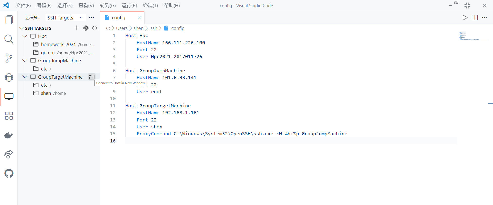

# 小组服务器使用指南

> 口笛吹いて歩こう 肩落としてる友よ  吹起口哨散个步吧 我沮丧着的朋友呀
>
> いろんな事があるけど 空には星が綺麗  虽然发生很多事 天上还是有美丽的星星

## 基本情况

跳板机（101.6.33.141），既可以与处于校园网环境的机器用ssh相互连接，也可以连接到处于内网的目标机，即实际计算服务器。

目标机（192.168.1.161），实际负责的计算的服务器，处于内网中，跳板机可以用ssh连接到它，而它不能反向连接到跳板机。

在使用小组服务器做计算时，最基本的方式是用处于校园网环境的机器登陆到跳板机，然后在跳板机上继续登陆到小组服务器，在小组服务器上提交计算任务，这也是大多数实验室的配置。

## 服务器用户管理

由于跳板机只负责作为连接目标机的中转，因此直接用root账户登陆跳板机即可：

```shell
ssh root@101.6.33.141
```

在登陆到跳板机后，继续登录到小组服务器的个人账户上，比如`ssh shen@192.168.1.161`，当还没有创建个人账户时，可以先登录root来创建自己的个人账户：

```shell
ssh root@192.168.1.161
useradd -m -s /bin/bash yourname
passwd yourname
```

其中`-m`表示自动创建用户的家目录，`-s /bin/bash`表示指定用户登入后使用的shell为bash。之后执行`passwd yourname`后提示输入密码，完成后新用户创建成功。执行`exit`命令后，退出目标机的root账户，退回到跳板机的root账户，此时执行：

```shell
ssh yourname@192.168.1.161
```

输入密码即可登录到个人账户，进入到个人用户的家目录中。在linux系统中，个人用户目录都在`/home`路径下，比如`/home/shen`，`/home/yanglei`，这称为对应用户的家目录，每个用户的文件应当都保存在自己的家目录中，不污染服务器的公用环境。`~`即代表当前用户的家目录，`/`代表根目录，处于目录的最顶端。

## 服务器环境的配置

### 个人配置文件

linux下环境变量配置文件大体上可以分为全局和个人两个层级，其中全局用户配置文件`/etc/profile`为所有用户登陆时都会执行的配置文件，这个文件配置了基本的用户环境变量、搜索路径等信息。由于这个配置会影响所有人的设置，一般不建议直接对这个文件作修改，这样会破坏服务器的环境。个人配置文件主要是用户个人目录下的`.bash_profile`文件，每个用户登陆时，都会执行用户自己家目录中的`.bash_profile`文件，这个配置文件只对个人有效。因此在配置自己的环境时，推荐的做法就是修改家目录中的`.bash_profile`文件。

### 更改自己喜欢的终端

定义一个好看的终端，每次输入命令心情都会好很多，在unix系统中，可以指定个人的`PS1`环境变量来改变终端的显示，比如在我的mac上的终端长成这个样子：


可以在个人用户目录下的`.bash_profile`文件设置PS1变量，上面终端对应的PS1变量为：

```shell
export PS1="\[\033[01;31m\]shen\[\033[00m\]@\[\033[01;32m\]\
Pinball, 1973🍄\[\033[00m\][\[\033[01;33m\]\t\[\033[00m\]]:\
\[\033[01;34m\]\w\[\033[00m\]\n$ "
```

### 定义自己的别名

可能有一些常用的提交命令很长，比如提交计算的并行lammps程序，这时候可以指定alias，来用一个别名代替这一长串命令。在家目录中的`.bash_profile`文件中，可以添加：

```shell
alias hello='echo hi!welcome back!'
```

此时在终端中键入hello，就会自动执行后面引号中的命令了：


### 环境变量

服务器上程序依赖于环境变量主要有两个方面，一是程序编译，二是程序运行。在程序编译连接时，其依赖于特定版本的编译器、并行库和数学库。程序安装过程实际上上面三个部分的特定组合，常用的两套编译器有GCC和INTEL：

|                  |   GCC    | INTEL |
| :--------------: | :------: | :---: |
|     C编译器      |   gcc    |  icc  |
|    C++编译器     |   g++    | icpc  |
| Fortran 77编译器 |   g77    | ifort |
| Fortran 90编译器 | gfortran | ifort |

并行实现一般有openmp和mpi两种，openmp和mpi本身都不是语言，均是并行程序设计的标准，根据不同语言有不同的实现形式。其中OpenMP是一种线程级的面向共享存储的并行程序设计标准，其编写较为简单，只要在源文件中的特定位置添加编译制导语句`#pragma`即可，在编译时指定`-fopenmp`参数，编译器就会按照openmp协议对程序执行并行化了。MPI是进程级的面向分布式存储的并行程序设计标准，适用于集群中多机多节点的并行化。其编译较openmp更为复杂，需要在普通编译器的基础上添加必要的MPI参数来执行编译，基于以上两套普通编译器，常用的有两套对应的MPI实现：

|                  | openmpi | intermpi |
| :--------------: | :-----: | :------: |
| 调用的基础编译器 |   GCC   |  INTEL   |
|     C编译器      |  mpicc  |  mpiicc  |
|    C++编译器     | mpicxx  | mpiicpc  |
| Fortran 77编译器 | mpif77  | mpifort  |
| Fortran 90编译器 | mpif90  | mpifort  |

不同版本的mpi实现对应着不同的基础编译器版本，不同的编译器版本也对应着不同动态库的版本，使用时需搭配使用。比如要使用gcc-4.7.1编译器及其对应的openmpi环境，则应分别修改`PATH`和`LD_LIBRARY_PATH`环境变量，把所需要的gcc和openmpi可执行文件的`bin`目录及对应动态库的`lib`目录分别添加到这两个环境变量中，也就是要做4次环境变量修改。当然有了Environment modules工具后这些都可以一起用`module load`命令加载了。一般情况下大家都会用到的程序已经被安装到了`/home/opt`文件夹中（为什么不是`/opt`文件夹中呢？），就不再需要自己再编译了。另一方面小组服务器也没有安装Environment modules工具，更改起来也要麻烦一点。

### Environment modules

服务器上通常存在不同版本的多种编译器、软件、MPI实现、链接库等等，使用的时候搭配使用，并对环境变量做出更改，这些实现间可能还存在着依赖关系，这都会对环境变量的更改造成困难。Environment modules是一套批量设置所需环境变量的工具，通过`module avail`可以显示目前可以使用的模块，通过`module load `可以加载指定的模块，加载后环境变量就配置成了对应编译器和库版本等的状态，通过`module unload`可以退出指定模块。一般的超算平台上都会提供Environment modules工具，配置相应的环境和模块一般是超算管理员的工作，比如太湖之光或者清华的探索100集群机，但在实验室的小组服务器上是没有配置的。当然，可以自行安装，配置自己需要的模块。

### conda虚拟环境

conda是python包管理和环境管理的基本工具，可以将anaconda官网下载的.sh文件上传到小组服务器后进行安装，然而小组服务器不能联网，没法直接使用conda安装包，然而conda最有用的地方就是自动检测包之间的依赖关系。此时想要手动解决依赖，手动安装包是一个不现实的行为。最好的解决方案就是在自己的linux虚拟机上建立一个虚拟环境，装好自己所需要的包，然后采用

```shell
conda pack -n my_env -p my_env.tar.gz
```

命令将`my_env`虚拟环境压缩成`my_env.tar.gz`文件，将这个文件上传到服务器上，解压后放到`anaconda3/envs/`目录下就可以正常使用该虚拟环境中的包了。

## 免密登陆

正常情况下使用ssh登陆远程主机时，每次都必须输入密码，但我们可以用公钥登陆的方式代替密码登陆。

每一个用户都有自己的公钥和私钥，所谓公钥登陆就是用户把自己的公钥储存到远程主机上，用户登陆的时候，远程主机会向用户发送一段随机字符串，用户用自己的私钥加密后，再发送回主机。远程主机用事先储存的用户公钥进行解密。如果解密成功，则说明用户是可信的，允许直接登陆shell，不再要求输入密码。在含有跳板机的情况下，为了做到免密登陆，一共要进行三次公钥上传：

1. 将自己机器的公钥上传到跳板机
2. 将跳板机的公钥上传到目标机
3. 将自己机器的公钥上传到目标机

在没生成过公钥和私钥时，可以在终端中执行（windows为powershell）：

```shell
ssh-keygen
```

一路Enter，将不为密钥文件设置密码。此时会在家目录的`.ssh`文件夹中生成`id_rsa`和`id_rsa.pub`，分别为私钥和公钥。上传公钥的意思就是自己生成的`id_rsa.pub`中的内容拷贝到目标服务器`.ssh`文件夹中的`authorized_keys`文件中。上传写入过程可以用终端命令来执行，比如通过管道直接写入：

```shell
cat ~/.ssh/id_rsa.pub | ssh root@101.6.33.141 "cat >> ~/.ssh/authorized_keys"
```

在ssh后面可以用引号扩起来直接登陆执行命令。如果使用后面介绍的vscode开发工具等，直接复制粘贴就可以了。要注意服务器上家目录中的`.ssh`文件夹默认没有权限，需要修改权限后才能免密登录（几个月之后我才明白为什么上传了公钥还是要输入密码）：

```SHELL
chmod -R 700 ~/.ssh
```

## 使用ssh config文件

ssh程序除了可以在命令行中直接给出连接参数以外，还可以从用户目录下的`.ssh/config`文件中读取配置信息，进行直接连接。config文件一般的配置如下：

```
Host GroupJumpMachine
	HostName 101.6.33.141
	Port 22
	User root

Host GroupTargetMachine
	HostName 192.168.1.161
	Port 22
	User shen
	ProxyCommand C:\Windows\System32\OpenSSH\ssh.exe -W %h:%p GroupJumpMachine
```

其中`Host`后面为所要连接主机的别名，`HostName`后为远程主机的ip，`Port`为所要连接的端口，`User`为要登录的账户，此时直接在终端输入：

```shell
ssh GroupJumpMachine
```

就相当于执行：

```shell
ssh -p 22 root@101.6.33.141
```

在远程服务器需要跳板机才能登陆时，可以在config文件中指定`ProxyCommand`选项，其中`C:\Windows\System32\OpenSSH\ssh.exe`为ssh程序的位置，在unix系统下直接写ssh就可以了。`%h`和`%p`分别代表目标机的hostname和port，即ip地址和端口。这样写可以使得在写其他目标机的config文件时，`ProxyCommand`这行不需要跟着变化，直接复制过来就可以了。`-W`参数表示stdio forwarding模式，具体什么意思我还并不是太清楚。此时在终端中直接输入：

```shell
ssh GroupTargetMachine
```

就可以直接连接到目标机了。

## ssh端口转发

端口转发是很有趣而且很有用的功能，根据端口转发的方式可以分为本地端口转发、远程端口转发和动态端口转发三类

### 本地端口转发

比如现在有这样的情况，主机C在某个端口提供服务，主机A需要访问主机C的该端口访问这个服务，但是主机A和主机C无法建立连接，比如C处于内网中。但是发现存在一个主机B，它可以建立与主机C的连接，即B->C，同时主机A也可以连到主机B，即A->B，我们可以利用主机B，建立A和C之间的连接。这就是本地端口转发的概念，因为本地端口转发相当于建立了一条A->C的连接通道，因此也被称为“ssh隧道”。

使用本地端口转发，可以在主机A执行：

```shell
ssh -L 指定的A的端口号:C的ip:指定的C的端口号 user@B的ip
```

上面这个命令表示，当我们访问主机A的指定端口号时，会先登录B中的user账户，在通过B将请求转发到C的指定端口号中。此时访问A的指定端口，就相当于直接访问C的服务端口。注意上面也可以直接用ssh config文件中设置的别名来进行连接，把后面的`root@101.6.33.141`替换成`GroupJumpMachine`。举三个小例子：


此时通过跳板机建立了本地主机A的9001端口和远程小组服务器22端口的ssh隧道，保持这个窗口不要关闭，ssh隧道就会保持建立。此时ssh登录本机的9001端口，就相当于直接登录小组服务器：


另一个比较有趣的应用是，比如现在在小组服务器的8090端口启动了一个jupyter服务：


此时可以用本地代理转发来访问服务器的jupyter服务：


将本地的5890端口映射到服务器的8890端口，此时在本地的5890端口可以直接打开远程的jupyter lab：


在执行端口转发时，可以加上`-N -f`参数，分别代表不要执行远程命令，进入后台执行。最后介绍的使用vscode进行远程开发时，vscode自动执行了端口转发，此时就不再需要手动执行了。

又比如一个比较常见的需求是，把本地的文件经跳板机上传到服务器上，此时可以建立一个本地端口转发：

```shell
ssh -NfL 9001:192.168.1.161:22 GroupJumpMachine
```

在9001端口用scp进行文件上传即可：


### 远程端口转发

远程端口转发实际上还是建立想要建立A->C的连接，本地端口转发的情况是存在A->B，B->C的连接，而远程端口转发的情况是存在B->A，B->C的连接，此时没法用主机A连接到主机B，就没法在本机主机A执行本地端口转发了建立ssh隧道了。但是发现B既可以连接A也可以连接C，我们可以在B上建立A与C之间的连接。由于此时并不是在本地主机A上建立ssh隧道，称这种连接方式叫作远程端口转发。在主机B上建立远程端口转发的命令为：

```shell
ssh -R 指定的A的端口号:C的ip:指定的C的端口号 user@A的ip
```

实现的功能还是在本地主机A上通过访问指定端口号来访问服务器C上的服务端口，但是此时有趣的是，我们发现本地主机A和远程服务器C的地位是相等的，换言之，通过远程端口转发，可以让处在内网的服务器C反向连接到本地主机A：


连接到跳板机，建立远程端口转发，建立服务器C的9001端口与本地主机22端口的ssh隧道，此时在服务器C上，访问ssh登录9001端口，就相当于登录本地主机A：


这里让小组服务器连接到了我的实验室windows主机上，由于我没有把服务器的公钥传到主机上，这里需要输入密码。windows上开启ssh server服务需要安装OpenSSH Server，具体操作可以搜索到。通过这种基本的相互端口转发，可以构建出复合的链式ssh隧道，结合具体的需求和主机的分布情况。

### 动态端口转发（代理上网）

本地端口转发和远程端口转发都是一对一的建立端口之间的映射关系，且端口之间代表的应用层协议也是一对一的关系。动态端口转发可以由ssh来判断向端口发起请求的工具使用的是什么应用层协议，然后根据判断出的协议结果决定目标端口。动态端口转发的执行命令为：

```shell
ssh -D 指定的本地端口号 user@远程主机ip
```

比如在跳板机上执行：

```shell
ssh -D 9090 shen@101.6.34.59 -N -f
```

这是把跳板机的9090端口动态转发到了我的实验室主机上，这时在跳板机就可以用socks5代理联网了：

```shell
curl --socks5 127.0.0.1:9090 http://www.heatenergist.org/
```

但我始终没能让最里面的服务器联网..对于什么网络协议、代理的知识太过于欠缺，慢慢学习（*虽然每天都用shadowsocks*）/

## 提交任务

### 直接提交

小组服务器就是个大型机器，并不是像太湖之光一样由计算节点和登陆节点组成的集群机，因此可以直接运行某型程序。比如这样一个hello world的C程序：

```c
#include <stdio.h>
#include <mpi.h>
 
int main (int argc, char *argv[])
//      int argc;
//      char *argv[];
{
        int myid, numprocs, namelen;
        char processor_name[MPI_MAX_PROCESSOR_NAME];
 
        MPI_Init (&argc, &argv);        /* starts MPI */
        MPI_Comm_rank (MPI_COMM_WORLD, &myid);  /* get current process id */
        MPI_Comm_size (MPI_COMM_WORLD, &numprocs);      /* get number of processes */
        MPI_Get_processor_name(processor_name,&namelen);
 
        if(myid == 0) printf("number of processes: %d\n",numprocs);
        printf( "%s: Hello world from process %d \n", processor_name, myid);
 
        MPI_Finalize();
        return 0;
}
```

健康地编译链接运行就好了：


要注意openmp进行的是单进程多线程并行，因此运行openmp并行的程序时直接`./program`就好了，和串行程序的运行没有什么区别；而MPI是多进程的并行，不同进程间靠消息传递来进行同步，因此必须用`mpiexec -n 24 ./program`这样的方式来运行。

### slurm脚本

集群机、超算有大量的节点和大量的任务，因此必须配备作业调度系统，来对计算任务按队列进行分配，同时监控节点的状态。一般而言，应用比较广泛的作业调度系统有lsf和slurm两种，太湖之光使用的是lsf系统。当然小组服务器不存在什么复杂的调度问题，但是通过slurm提交的任务，可以查看它的队列信息，以及所用的核数，当核占满的时候后边提交的任务也会自动排队，这方便了其他人的使用。可以通过`srun`命令来提交一个程序：

```shell
srun -n 10 hello -o file.out -e file.error &
```

可以用`squeue`查看一下现在的队列信息：


可以用`scancel JOBID`来取消一个任务.

当然，有时候可能会指定很多参数，或者批处理提交一些脚本，这时可以编写slurm脚本，用`sbatch some_script`命令来提交。slurm脚本包含两部分，上半部分用`#`开头的部分是指定作业提交的信息，分配的节点和核数目等，下半部分是实际要执行的程序，在程序执行前，也可以加上一些shell命令，做一些配置和准备的工作等：

```shel
#!/bin/bash
#SBATCH -J work_name
#SBATCH -p batch
#SBATCH -N 1
#SBATCH -o file.out
#SBATCH -e file.error
#SBATCH --ntasks-per-node=4

for i in {1..10}
do 
echo hello,world!
done

mpiexec -n 4 hello
```

其中`-J`指的是作业名字，`-p`为提交的分区，小组服务器只有batch，`-N`为节点数目，小组服务器只有一个节点，`-o`为输出的文件，`-e`为输出错误的文件，`--ntasks-per-node`为每个节点分配的核的数目，注意`--ntasks-per-node * -N`必须和`mpiexec -n `后面的数目相等。

执行`sbatch hello.sh`提交slurm脚本。得到的输出为：


## 在vscode中远程开发

下载vscode，在扩展中安装Remote-SSH插件：


它会自动检测设置的ssh config文件，检测相应的远程主机，点击左侧的窗口+，即可按照ssh config文件中指定的方式连接到目标服务器



连接之后，可以像在本地一样对远程文件进行编辑，甚至可以直接打开jupyter（这是因为vscode自动进行了端口转发，此时把jupyter服务的地址直接复制到浏览器里也是可以打开的）：


但值得注意的是在vscode中服务器端和本地的插件是不共享的，如果想要在服务器上使用插件需要重新下载，有时会出现下载错误的问题，这时手动下载.vsix文件进行插件安装。

