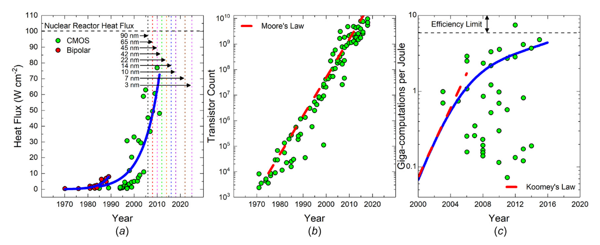

# 热量输运在电子封装中的影响和应用

## 原文

这是一篇综述的阅读记录。

Warzoha R J, Wilson A A, Donovan B F, et al. Applications and impacts of nanoscale thermal transport in electronics packaging[J]. Journal of Electronic Packaging, 2021, 143(2): 020804.

## 电子器件热管理

### 摩尔定律

我是图片标题

