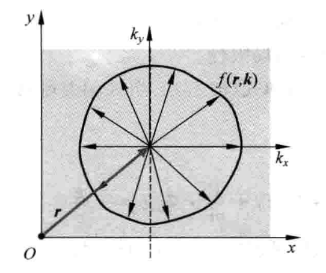

# 输运过程(1)-从BTE到声子热导率

> Chen G. Nanoscale energy transport and conversion: a parallel treatment of electrons, molecules, phonons, and photons[M]. Oxford university press, 2005.

## 线性Boltzmann方程

在弛豫时间近似下，BTE的形式为：
$$
\frac{\partial f}{\partial t}+v \cdot \nabla_{r} f+\frac{\boldsymbol{F}}{m} \cdot \nabla_{v} f=-\frac{f-f_{0}}{\tau}
$$
引入偏差函数：
$$
g = f - f_0
$$
此时BTE可以改写为：
$$
\frac{\partial g}{\partial t}+\frac{\partial f_{0}}{\partial t}+v \cdot \nabla_{r} f_{0}+v \cdot \nabla_{r} g+\frac{\boldsymbol{F}}{m} \cdot \nabla_{v} f_{0}+\frac{\boldsymbol{F}}{m} \cdot \nabla_{v} g=-\frac{g}{\tau}
$$
考虑分布函数离平衡态偏差很小的情况，此时成立以下假设：

- 非稳态项可以忽略
- $g$的梯度远远小于$f_0$的梯度
- $g$远小于$f_0$

于是方程可以简化为：
$$
g=-\tau\left(v \cdot \nabla_{r} f_{0}+\frac{\boldsymbol{F}}{m} \cdot \nabla_{v} f_{0}\right)
$$
即：
$$
f=f_0-\tau\left(v \cdot \nabla_{r} f_{0}+\frac{\boldsymbol{F}}{m} \cdot \nabla_{v} f_{0}\right)
$$
在小扰动情况下，分布函数的解可以通过把$g$看成是$f$的一阶展开（$f_0$是$f$的零阶展开）并忽略高阶项得到，这个方程被称作线性Boltzmann方程，由分布函数可以计算各种感兴趣物理量的通量，进而计算等效输运系数。

## 傅立叶定律与声子热导率

考虑声子的热传导，这种情况没有外力，平衡分布为玻色-爱因斯坦分布，这个分布只是温度的函数：
$$
f_{0}=\frac{1}{\exp \left(\hbar \omega / k_{\mathrm{B}} T\right)-1}
$$
于是线性BTE可以写为：
$$
f(\boldsymbol{r}, \boldsymbol{k})=f_{0}-\tau \frac{\mathrm{d} f_{0}}{\mathrm{~d} T} \boldsymbol{v} \cdot \nabla T
$$
x方向的热通量公式为：
$$
J_{q x}(x)=\sum_{s}\left[\frac{1}{V} \sum_{k_{x 1}} \sum_{k_{y 1}} \sum_{k_{z 1}}v_{x} \hbar \omega f\right]
$$
其中$\sum_{s}$代表对所有声子支求和。要注意$f(\boldsymbol{r}, \boldsymbol{k})$是一个六维变量的函数，即使三个空间坐标的函数也是三个波矢空间坐标的函数，因此在计算实空间某一点的物理量时，要考虑波矢空间所有的贡献。在统计物理的图像中，可以理解为存在着一系列不同的能级，每一能级上都分布着不同数目的声子，不同能级上的声子的性质也不相同，宏观的性质是各个能级上的声子贡献之和。在声子图像中，我们认为声子有着不同支，每一支又有着不同波矢的状态，这一个状态叫作一个声子模式，就相当于统计物理中的一个能级，$f$就代表这个能级上的声子数目。

将离散求和改写为积分：

$$
\begin{aligned}

J_{q x}(x) &=\sum_{s}\left[\frac{1}{V} \sum_{k_{x 1}} \sum_{k_{y 1}} \sum_{k_{z 1}}v_{x} \hbar \omega f\right]\\
&=\sum_{s} \int_{-\infty}^{\infty} \int_{-\infty}^{\infty} \int_{-\infty}^{\infty} v_{x} \hbar \omega f \mathrm{~d} k_{x} \mathrm{~d} k_{y} \mathrm{~d} k_{z} /(2 \pi)^{3} \\
&=\int_{0}^{\omega_{\max }} \mathrm{d} \omega\left[\int_{0}^{2 \pi}\left\{\int_{0}^{\pi} v \cos \theta \hbar \omega f \frac{D(\omega)}{4 \pi} \sin \theta \mathrm{d} \theta\right\} \mathrm{d} \varphi\right]
\end{aligned}
$$
这里要做一些说明，在量子理论中，在能量准连续的条件下，对于量子数足够大的状态，一个量子态在相空间中对应$h^r$的相体积，其中$r$为粒子的自由度数目，对于三维的粒子来说，$r=3$。于是量子态数目可以表示为：
$$
\begin{aligned}
N &= \Omega / h^3 \\
&= \int \mathrm{d}x\mathrm{d}y\mathrm{d}z\mathrm{d}p_x\mathrm{d}p_y\mathrm{d}p_z / h^3 \\
&= V\int \hbar^3 \mathrm{d} k_x \mathrm{d} k_y \mathrm{d} k_z / h^3\\
&= V/(2\pi)^3 \int \mathrm{d} k_x \mathrm{d} k_y \mathrm{d} k_z
\end{aligned}
$$
于是$k$空间中一个量子态的体积为$(2\pi)^3/V$，代回到上面热流公式得到第二行的积分表达式。把第二行笛卡尔坐标系积分转化成球坐标系积分：
$$
\begin{aligned}
& \sum_{s} \int_{-\infty}^{\infty} \int_{-\infty}^{\infty} \int_{-\infty}^{\infty} v_{x} \hbar \omega f \mathrm{~d} k_{x} \mathrm{~d} k_{y} \mathrm{~d} k_{z} /(2 \pi)^{3} \\
&=\sum_{s} \int_{0}^{\infty} \mathrm{d}k \int_{0}^{\pi}\mathrm{d}\theta \int_{0}^{2\pi}\mathrm{d} \phi  \, k^2\sin\theta v \cos \theta \hbar \omega f / (2 \pi)^{3} 
\end{aligned}
$$
波矢和频率满足：
$$
\int_0^{\infty}\mathrm{d}k = \int_0^{\omega_{max}}\frac{\mathrm{d}k}{\mathrm{d}\omega}\mathrm{d}\omega = \int_0^{\omega_{max}}\frac{1}{v}\mathrm{d}\omega
$$
于是：
$$
\begin{aligned}
&\sum_{s} \int_{0}^{\infty} \mathrm{d}k \int_{0}^{\pi}\mathrm{d}\theta \int_{0}^{2\pi}\mathrm{d} \phi  \, k^2\sin\theta v \cos \theta \hbar \omega f / (2 \pi)^{3}\\
&=\sum_{s} \int_{0}^{\omega_{\max}} \mathrm{d}\omega \int_{0}^{\pi}\mathrm{d}\theta \int_{0}^{2\pi}\mathrm{d} \phi  \, k^2\sin\theta  \cos \theta \hbar \omega f / (2 \pi)^{3}
\end{aligned}
$$
同时，可以把上面量子态数目的表达式写成球坐标的形式：
$$
\begin{aligned}
N &= V/(2\pi)^3 \int \mathrm{d} k_x \mathrm{d} k_y \mathrm{d} k_z \\
&= V/(2\pi)^3 \int 4\pi k^2 \mathrm{d}k \\
&= V/(2\pi)^3 \int_0^{\omega_{max}} 4\pi k^2 /v \, \mathrm{d}\omega \\
&= V \int_0^{\omega_{max}} \frac{k^2}{2\pi^2 v}d\omega
\end{aligned}
$$
把$\dfrac{k^2}{2\pi^2 v}$定义为态密度$D(\omega)$，于是就把量子态沿波矢大小的分布转换到沿频率大小的分布上了，在统计物理中，这个态密度实际上就是能级的简并度。将态密度的表达式代入热流公式的球坐标积分中：
$$
J_{q x}(x) = \sum_{s} \int_{0}^{\omega_{\max}} \mathrm{d}\omega \int_{0}^{\pi}\mathrm{d}\theta \int_{0}^{2\pi}\mathrm{d} \phi  \,D(\omega)\sin\theta v \cos \theta \hbar \omega f / 4\pi
$$
将线性玻尔兹曼方程代入热流公式：
$$
\begin{aligned}
J_{q x}(x) &=\int_{0}^{\omega_{\max }} \mathrm{d} \omega\left[\int_{0}^{2 \pi}\left\{\int_{0}^{\pi} v \cos \theta \hbar \omega\left[f_{0}-\tau \frac{\mathrm{d} f_{0}}{\mathrm{~d} T} \frac{\mathrm{d} T}{\mathrm{~d} x} v \cos \theta\right] \frac{D(\omega)}{4 \pi} \sin \theta \mathrm{d} \theta\right\} \mathrm{d} \varphi\right] \\
&=-\frac{1}{2} \frac{\mathrm{d} T}{\mathrm{~d} x} \int_{0}^{\omega_{\max }} \mathrm{d} \omega\left\{\int_{0}^{\pi} \tau v^{2} \sin \theta \cos ^{2} \theta \times \hbar \omega D(\omega) \frac{\mathrm{d} f_{0}}{\mathrm{~d} T} \mathrm{~d} \theta\right\}
\end{aligned}
$$
平衡分布不对通量作出贡献，能量从左到右以及相反传递时，它的值相同。此时热流的表达式可以写成傅里叶定律的形式：
$$
J_{q x}(x) = -k \frac{\mathrm{d}T}{\mathrm{d}x}
$$
于是热导率的表达式为：
$$
k = -\frac{1}{2}\int_{0}^{\omega_{\max }} \mathrm{d} \omega\left\{\int_{0}^{\pi} \tau v^{2} \sin \theta \cos ^{2} \theta \times \hbar \omega D(\omega) \frac{\mathrm{d} f_{0}}{\mathrm{~d} T} \mathrm{~d} \theta\right\}
$$
其中，
$$
C_{\omega}=\hbar \omega D(\omega) \mathrm{d} f_{0} / \mathrm{d} T
$$
是在频率$\omega$和温度$T$下单位频率的比热，于是：
$$
k = \frac{1}{3} \int \tau v^{2} C_{\omega} \mathrm{d} \omega =  \frac{1}{3} \int  C_{\omega}vl \mathrm{d} \omega
$$
