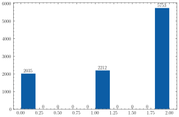
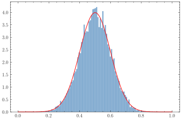

# 马尔可夫蒙特卡洛（MCMC）

## MD 与 MC

一次计算机模拟的出发点是一个物理系统的一个完全确定的模型，我们对计算这个物理系统的性质感兴趣，这些性质或可观察量是通过在某个样本空间中求平均而得到的。比如一个简谐振子，这个系统的温度是作为沿着生成轨道的平均动能而算出的。

我们假定，所考虑的系统有一个模型哈密顿量$\mathscr{H}$，用$\boldsymbol{x}=(x_1,x_2,\ldots,x_n)$表示这个系统的状态，状态的集合构成了系统的相空间$\Omega$，要计算的量$A$是系统状态的函数。量$A$的值由下式给出：

$$
\left< A \right> = Z^{-1} \int_{\Omega}A(\boldsymbol{x})f(\mathscr{H}(\boldsymbol{x}))\mathrm{d}\boldsymbol{x}
$$

其中$f$为分布函数，配分函数$Z$为相应的系综平均，$f(\boldsymbol{x})/Z$即相当于概率密度函数$\rho(\boldsymbol{x})$

$$
Z = \int_{\Omega}f(\mathscr{H}(x))\mathrm{d}\boldsymbol{x}
$$

因此一个计算机模拟过程本质上进行的工作就是求$A(\boldsymbol{x})$在相空间上的期望，即所谓的系综平均，本质上就是做一个高维空间数值积分。当然，计算机模拟中一次只能模拟一个系统，因此无论是蒙特卡洛模拟还是分子动力学模拟，本质上都是让一个系统沿着相空间的轨道演化，假设这个系统在足够长的时间内可以遍历整个相空间，因此对着这一个系统所经历的相轨道求平均，就相当于做了相空间上的平均。在这一层面这两种方法是一致的。

两种方法的本质区别是如何使得一个系统在相空间上演化。分子动力学方法按照模型内部的动力学规律使系统进行演化，给出各粒子的初始位置，可以计算粒子之间的受力，从而按照牛顿力学计算速度以及加速度，这将让系统演化出一条相空间轨道。换言之，分子动力学中引发系统从一个构型到另一个构型转变，是通过动量来实现的。在蒙特卡洛方法中，不需要计算速度，系统从一个构型跳跃到下一个构型，这种转变通过马尔可夫过程由一个概率性的演化引起。这个马尔可夫过程就是分子动力学模拟中内禀动力学在概率方面的对应物。

## 马尔可夫过程

马尔可夫链：某一时刻状态转移的概率只取决于当前概率。即，

$$
P\left(X^{t+1} \mid X^{1}, \ldots, X^{t}\right)=P\left(X^{t+1} \mid X^{t}\right)
$$

假如系统可能的状态有三个1，2，3，则系统各个状态之间的相互转移概率可用一个状态转移矩阵来描述：

$$
P = 
\left[
\begin{matrix}
0.1 & 0.4 & 0.5 \\
0.3 & 0.1 & 0.6 \\
0.2 & 0.2 &0.6
\end{matrix}
\right]
$$

其中$P_{ij}$表示从状态$i$跳到状态$j$的概率。若初始概率分布为：

$$
v = \left(
\begin{array}{ccc}
0.3&0.3&0.4
\end{array} 
\right)
$$

则每经过一次马尔可夫过程，概率分布变化为：

$$
v^{n+1} = v^{n} P
$$

若经过了n次马尔可夫过程，则最终概率分布和初始概率分布的关系为：

$$
v^{n} = v P^n
$$

马尔可夫过程具有如下性质：如果一个马尔可夫过程是非周期的，且其任意两个状态是相连通的，在经历了足够长的转移过后，

$$
\lim _{\imath \rightarrow \infty} P^{n}=\left[\begin{array}{ccccc}
\pi(1) & \pi(2) & \cdots & \pi(j) & \cdots \\
\pi(1) & \pi(2) & \cdots & \pi(j) & \cdots \\
\vdots & \vdots & \vdots & \ddots & \vdots \\
\pi(1) & \pi(2) & \cdots & \pi(j) & \cdots \\
\vdots & \vdots & \vdots & \ddots & \vdots
\end{array}\right]
$$

对于任意的概率分布$v$，都将收敛到$P$的平稳分布：

$$
vP^n = \pi
$$

$$
\pi = (\pi_0,\pi_1,\ldots, \pi_n)
$$

在收敛到平稳分布后，继续右乘转移矩阵，分布保持不变，还是平稳分布：

$$
\pi P = \pi
$$

换言之这个平稳分布$\pi$就是矩阵$P$以1为特征值的特征向量，$\pi$是$\pi P = \pi$的唯一非负解。

对于上面给出的转移矩阵$P$，它的平稳分布为：

$$
\pi = 
\left(
\begin{array}{c}
0.20168067 & 0.21848739 & 0.57983193
\end{array}
\right)
$$

相乘20次后：

```python
A = np.array([0.1,0.4,0.5,\
              0.3,0.1,0.6,\
              0.2,0.2,0.6]).reshape(3,3) 
np.linalg.matrix_power(A,20)
```

输出为：

```python
array([[0.20168067, 0.21848739, 0.57983193],
       [0.20168067, 0.21848739, 0.57983193],
       [0.20168067, 0.21848739, 0.57983193]])
```


## 马尔可夫采样

在有了状态转移矩阵后，就可以用这个马尔可夫过程进行抽样了，首先随机选择一个初始状态$x_0$，按条件概率采样状态值$P(x|x_0)$采样状态值$x_1$。当采样到第$n$次时，认为此时采样点已经达到了平稳分布，则之后的采样集$(x_n,x_{n+1},x_{n+2},\ldots)$则可认为是从$\pi(x)$平稳分布中抽样了。

这里需要做一些说明，上面给定一个任意初始分布，右乘$n$次马尔可夫矩阵后，会达到平稳分布，在实际采样过程中，这个分布并不存在，或者说没有办法知道，每次只有一个采样点。每一次马尔可夫过程也并不是让一个分布右乘状态转移矩阵，而是在当前的采样点下随机跳动到下一个采样点。可以认为每一次采样都是在当前的分布下进行采样，在当前分布达到平稳分布后，分布不再发生改变，那么以后的每一次采样都相当于在平稳分布中采样，也就是以时间换空间的采样策略。这个当前分布的含义到底是什么呢，如何判断当前分布是否已经平稳了呢？从纯粹采样的角度我暂时也并不是很理解..

不过从分子模拟的角度来考虑，一开始的系统构型是人为初始化的，他一定不是最后稳态的构型。根据玻尔兹曼的最可几分布的想法，最后这个系统的构型一定稳定在某一个位置，这个位置有着极高的概率分布。也就是说$\rho(x)$的分布一定是有一个峰的，而初始构型一定离这个峰很远，当构型一步一步跳到这个峰的附近后，下一次抽样一定是大概率围绕在这个峰附近的..大概可以认为此时当前的分布就达到了平稳分布。这有点像梯度下降或者遗传算法的运动路径。

下面这段程序演示了一个简单的马尔可夫采样过程，系统一共有三个状态$0,1,2$，初始位置为$0$, 状态转移矩阵还是上面的形式，采样10000次：

```python
def choose_next(p,p_vec):
    _sum = 0
    for i,pp in enumerate(p_vec):
        _sum += pp
        if p < _sum:
            return i
x = 0
x_list = []
for i in range(10000):
    p = np.random.rand()
    x = choose_next(p,A[x])
    x_list.append(x)
x_list = np.array(x_list)
```

最后得到的分布如下图所示，和平稳分布已经很接近了，



## MCMC-马尔科夫蒙特卡洛

上部分提到的马尔可夫采样过程，是已知了状态转移矩阵后，对该状态转移矩阵平稳分布进行采样的过程。在实际过程中数值求期望和上述的过程是反过来的，不知道状态转移矩阵，而是知道最终的分布$\rho(x)$，

$$
\int f(x)\rho(x)\mathrm{d}x
$$

现在想要按照$\rho(x)\mathrm{d}x$来采样，在$\rho(x)$较大的位置多撒一些点，在$\rho(x)$较小的位置少撒一些点，最后把所有的点的$f(x)$取平均，得到的就是$f(x)$在$\rho(x)$分布下的期望。比如在正则系综中，分布函数是这个样子：

$$
\rho(\boldsymbol{x}) = \frac{1}{Z}\exp\left[ -\mathscr{H}\boldsymbol(x)/k_BT \right] = \rho(\boldsymbol{x}) = \frac{\exp\left[ -\mathscr{H}(\boldsymbol{x})/k_BT \right]}{\int_\Omega \exp\left[ -\mathscr{H}(\boldsymbol{x})/k_B T \right] \mathrm{d}\boldsymbol{x}}
$$

如何才能对这样一个维度极高，形式较为复杂的分布函数抽样？如何依据$\rho(x)$构造出上述的马尔可夫采样过程？马尔可夫蒙特卡洛(MCMC)给出了构造这样的马尔可夫过程的通用方法。

通过$\rho(x)$构造马尔可夫过程，实际上就是根据平稳分布$\pi(x)$构造状态转移矩阵$P$，为此有必要讨论$\pi(x)$和$P$之间的对应关系，上面已经给出了，
$$
\pi P = \pi
$$
展开形式，
$$
(\pi_1,\pi_2,\ldots,\pi_n)
\left[\begin{array}{ccccc}
P_{11} & P_{12} & \cdots & P_{1j} & \cdots \\
P_{21} & P_{22} & \cdots & P_{2j} & \cdots \\
\vdots & \vdots & \vdots & \ddots & \vdots \\
P_{i1} & P_{i2} & \cdots & P_{ij} & \cdots \\
\vdots & \vdots & \vdots & \ddots & \vdots
\end{array}\right] 
=
(\pi_1,\pi_2,\ldots,\pi_n)
$$
即：
$$
\pi_j = \sum_i P_{ij}\pi_i
$$
因为$P_{ij}$是系统从状态i跳到状态j的概率，必然满足$\sum_j P_{ij} = 1$，系统从i跳到其他所有可能状态的概率之和为1，因此可以将上面的等式换成一个更好理解的形式：
$$
\pi_j \sum_j P_{ij} =\sum_i P_{ij}\pi_i
$$
也就是说平稳分布和状态转移矩阵之间应满足，系统从状态j跳到所有其他可能的状态的概率之和应等于从其他可能的状态跳到j的状态之和，这也就是守恒条件。我们可以构造一个更强的稳定条件，使得：
$$
\pi_i P(i,j) = \pi_j P(j,i)
$$
此时系统从状态i跳到状态j的概率与系统从状态j跳到状态i的概率相等，这必然满足上面的稳定条件，因为这个约束规定了任意两个状态之间跳跃的概率相等，而稳定条件只要求概率之和相等。这个条件被称为马尔可夫链的细致平稳条件。假设能构造出一个符合细致平稳条件的状态转移矩阵，那这个马尔可夫过程最终必然会收敛到平稳分布。要构造这个矩阵，实际上就是给出$P(i,j)$，即从状态i到状态j的概率。构造思路如下，可以先随便取一个状态转移矩阵$Q(i,j)$，比如从i到j的概率就从$(0,1)$之间均匀分布，从j到i的概率也是$(0,1)$的均匀分布，这个状态转移概率当然不满足细致平稳条件，但是可以再在这个状态转移概率上乘一项修正，使它满足细致平稳条件：
$$
\pi_i Q(i,j) \alpha(i,j) = \pi_j Q(j,i) \alpha(j,i)
$$
假如$Q(i,j)$已经随便取了一个东西，那么现在的问题就是根据$\pi$和$Q(i,j)$的形式来确定$\alpha(i,j)$，为使等式成立，$\alpha(i,j)$最直观的形式就是：
$$
\alpha(i,j) = Q(j,i)\pi_j
$$
此时等式左右两边是完全对称的，这个问题到这里就已经被解决了，这就是MCMC算法在做的事情。当然此时这个$\alpha(i,j)$的选择并不是最优的，有可能$\alpha(i,j)$的值太低了，导致状态转移概率太低，使得大部分马尔可夫游走过程只进行了概率判断，并没有真正进行状态之间的跳跃，这会遍历稳态分布需要很长的时间。所以一个自然的想法就是尽可能提高$\alpha(i,j)$的值，对于细致平衡条件：
$$
\pi_i Q(i,j) \alpha(i,j) = \pi_j Q(j,i) \alpha(j,i)
$$
两边都放大相同的倍数，等式仍然成立。但是这个倍数不能放大太多倍，否则转移概率就会出现大于1的情况，放大的极限是
$$
\max(\alpha(i,j),\alpha(j,i)) = 1
$$
因此改进的接受率为：
$$
\alpha'(i,j) = \min(\frac{\pi(j)Q(j,i)}{\pi(i)Q(i,j)},1)
$$
这被称为MH算法。

现在假如要对$(0,1)$区间内$\mu=0.5,\sigma=0.1$的正态分布采样，每次在$(0,1)$随机选择一个新位置，用MH采样判断跳不跳到这个新位置：

```python
def normal(x):
    return 1/(0.1*np.sqrt(2*np.pi)) * np.exp(-((x-0.5)/0.1)**2 /(2))

def move(x):
    x_new = np.random.rand()
    p = normal(x)
    p_new = normal(x_new)
    alpha = min(p_new / p, 1.0)
    r = np.random.rand()
    if alpha >= r:
        x = x_new
    return x
  
samples = []
x = 0
for i in range(50000):
    x = move(x)
    samples.append(x)
```

50000步后结果如下：



## 正则系综的蒙特卡洛模拟

正则系综的分布函数为：
$$
\rho(\boldsymbol{x}) = \frac{1}{Z}\exp\left[ -\mathscr{H}\boldsymbol(x)/k_BT \right] = \rho(\boldsymbol{x}) = \frac{\exp\left[ -\mathscr{H}(\boldsymbol{x})/k_BT \right]}{\int_\Omega \exp\left[ -\mathscr{H}(\boldsymbol{x})/k_B T \right] \mathrm{d}\boldsymbol{x}}
$$
细致平衡条件：
$$
\rho(\boldsymbol{x_i}) Q(i,j) \alpha(i,j) = \rho(\boldsymbol{x_j}) Q(j,i) \alpha(j,i)
$$
带入分布函数：
$$
\exp\left[ -\mathscr{H}(\boldsymbol{x_i})/k_B T \right]Q(i,j)\alpha(i,j) = \exp\left[ -\mathscr{H}(\boldsymbol{x_j})/k_B T \right]Q(j,i)\alpha(j,i)
$$
取$Q$为均匀分布，则：
$$
\alpha(i,j) = \exp\left[ -\mathscr{H}(\boldsymbol{x_i})/k_B T \right], \alpha(j,i) = \exp\left[ -\mathscr{H}(\boldsymbol{x_j})/k_B T \right],
$$
利用MH算法改进接受率：
$$
\alpha'(i,j) = \min(\frac{\pi(j)Q(j,i)}{\pi(i)Q(i,j)},1) = \min \left(\exp\left[ - (\mathscr{H}(\boldsymbol{x_j}) - \mathscr{H}(\boldsymbol{x_i}))/k_B T \right], 1\right)
$$
这就是实际正则系综MC模拟中接受率的形式。因此正则系综的蒙特卡洛模拟算法可描述如下：

1. 规定一个初始构型
2. 随机挪动原子，产生一个新构型
3. 计算能量变化$\Delta \mathscr{H}$
4. 若$\Delta \mathscr{H} < 0$，接受新构型，回到第2步
5. 若$\Delta \mathscr{H} > 0$，计算$p = \exp\left[ - (\mathscr{H}(\boldsymbol{x_j}) - \mathscr{H}(\boldsymbol{x_i}))/k_B T \right]$
6. 产生一个随机数$R\in [0,1]$
7. 若$R < p$，接受新构型回到第2步
8. 否则，保留原始构型回到第2步

这个马尔可夫过程使得系统的构型朝向最小能量状态演化，对于一个能量更低的新构型无条件接受，而对于一个能量更高的构型按照玻尔兹曼概率接受。从这个角度来看，所有的随机优化方法如遗传算法，其基本思想都是类似的。